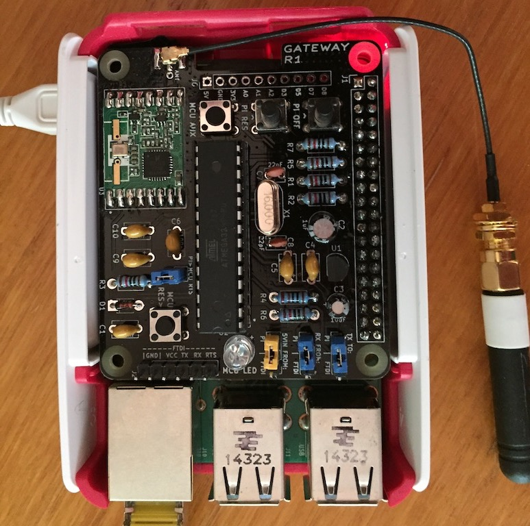
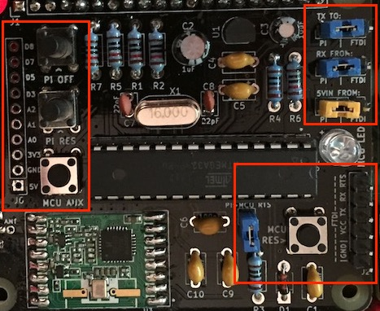
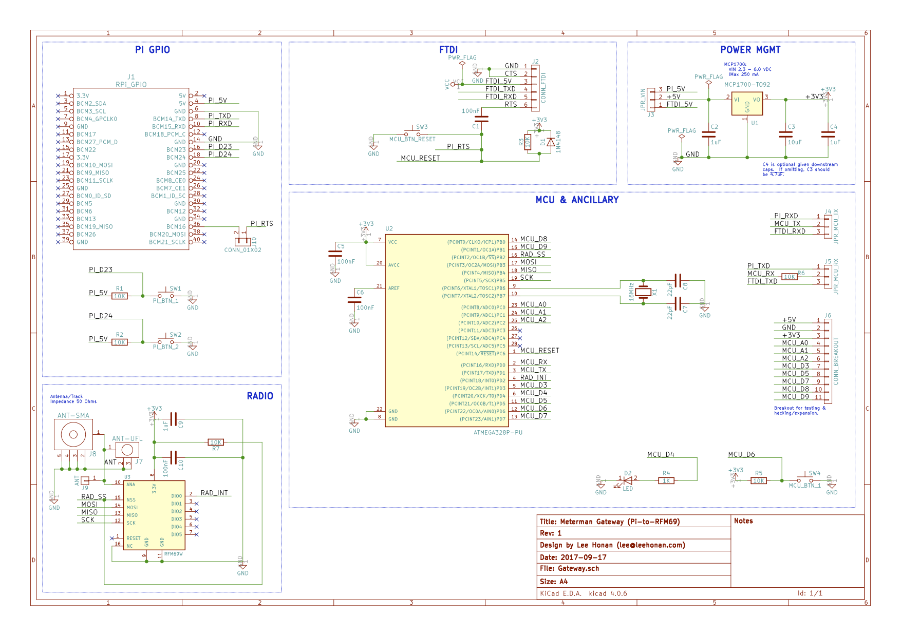
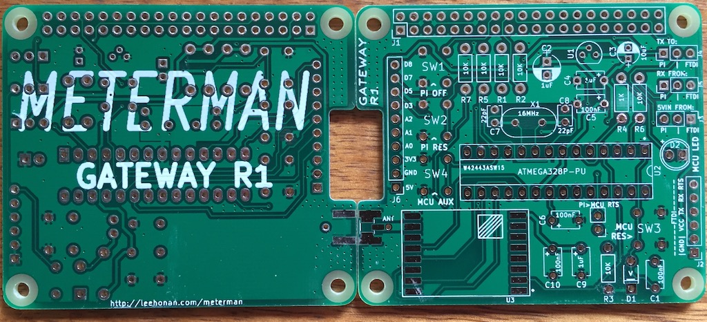

# Meterman Gateway (RFM69-to-Pi Gateway)

This repo contains PCB designs and firmware for a 'meter gateway' that communicates with one or more 'meter nodes' over packet radio.  It acts as a radio gateway between these and logic running on a local server.  Hardware consists of a ATMEGA 328P (with RFM69 radio), and a daughterboard to mate to a Raspberry Pi for Serial UART TX/RX and power (AKA a Pi Hat).  The PCB design could be used for a general-purpose RFM69-Pi Gateway, hacking the firmware code as needed.



(Note that as above a proper case is TBC)

This Gateway is part of a basic electricity monitoring system described at http://leehonan.com/meterman.  The 'MeterMan' system consists of:

* One or more [MeterNodes](https://github.com/leehonan/meterman-node), transmitting energy consumption at set intervals using sub-GHz packet radio (RFM69 @ 434/868/915MHz).

* The Gateway, being a Raspberry Pi 'Hat' that bridges the RFM69 network to a Raspberry Pi's UART Serial interface.

* A [Server](https://github.com/leehonan/meterman-server) that runs on the Pi, maintains energy consumption data, and provides access to this and other operational data through an API, a file journal, and a realtime socket API (socket API is TBD).

## This Repo

This (Gateway) repo consists of:

* The Gateway PCB design (authored in KiCad).  This mounts onto a Raspberry Pi, with ~12mm x 2.5mm spacers being recommended.

* 3D shape files (.STL) for the gateway housing (WIP).

* Source code for the Gateway firmware (AVR C with Arduino extensions).  

All contents are licenced according to the MIT licence.

## Gateway Overview
The Gateway is essentially a bridge between nodes on a RFM69 network and a local application connected to the Pi's UART serial port.  As the Gateway has been designed to support MeterNodes, much of the context for it is best understood by consulting the more comprehensive [MeterNode's ReadMe](https://github.com/leehonan/meterman-node/blob/master/readme.md) - it is not repeated here (DRY).

The Gateway itself comprises:
* A DC power sub-circuit, switchable using a jumper between 5V from the Raspberry Pi and FTDI (or off if no FTDI connection).  Uses a MCP1700 regulator to supply 3.3VDC.  

* An ATMega 328P MCU sub-circuit, along the lines of common 'minimal low-power Arduino' circuits.  FTDI Header for programming and control.

* A radio sub-circuit with an RFM69HW module.  The design uses an RP-SMA connector, but the PCB also supports uFL or a wire antenna.

The gateway does not have a 'real' RTC.  A timer-based clock is implemented in firmware, although this relies on regular synchronisation with its NTP-synced Pi (e.g. every 15m) to be accurate.

## Operation

 The Gateway:
* Polls for radio messages from nodes, responding to these as needed.  These may indicate events or status changes, which are passed through to the connected application (such as a meter update event).

* Keeps a register of meter nodes, maintaining state information and notifying the connected application when they appear to go offline.

* Polls for serial messages from the connected application, responding to these as needed.  Some of these will cause a particular instruction to be sent to a MeterNode(s) when they are available (e.g. to change their meter value).

* Sends messages to the connected application, such as a request from the Gateway to sync its clock.

The gateway runs continuously and does not sleep.  Its availability for radio messaging can therefore be depended upon by MeterNodes - hence all communication between MeterNodes and their Gateway is initiated by the MeterNodes.


### Gateway Hardware Interface
The MeterNode PCB has the following switches, buttons, headers, and adjustable components.  These are shown below.



* A group of 3 jumpers that toggle between the Pi and FTDI for TX from the MCU, RX by the MCU, and 5VDC In.  If the jumper is in the FTDI position but FTDI is not connected the device will be off.  Conversely if the switch is in the Pi position but a FTDI adapter is connected, power will be drawn from the Pi (with other FTDI functions working as normal).

* A 'Pi Off' button that shuts the Pi down (using the accompanying pi-gw-reboot script).

* A 'Pi Res' button that reboots the Pi (using the accompanying pi-gw-reboot script).

* A MCU Reset button that reboots the MCU.

* A MCU Aux button that can be programmed as needed (currently blinks LED).

* A jumper to allow the Pi to reboot the MCU (used when programming the MCU, safe to leave closed).

* An FTDI header for use with a USB-FTDI adapter.  This is used to upload firmware and also to interact with the MCU directly over a serial connection (viewing events and using the MeterNode's command protocol to view information and change settings).  Firmware can be uploaded using avrdude directly, or via an IDE (such as platform.io).  The use of the FTDI header is usually unnecessary with a Pi connected as all commands/operations can be performed from the Pi using its GPIO pins (assuming the enclosed scripts are installed).

* A breakout header that is used for setup and diagnosis, typically with a multimeter.  These can also be used for hacking together custom solutions.  The positions are described below and pictured above:

| Position | Description |
| :--- |:---|
| A0 - D8 | Access to unused analogue (A0 - A2) and digital (D3-D8) pins on the MCU. |
| GND | DC Ground. |
| 3V3   | 3.3VDC from regulator.  |
| 5V  | ~5VDC from Pi.  |

### Shutdown and Reboot
The Restart/Reboot and Shutdown buttons are connected to GPIO P23 and P24 (board numbering).  They perform a soft reboot or shutdown, equivalent to a `reboot` or `shutdown -h now`.

The enclosed pishutdown.py script needs to be installed for these to function, and to be set to start at boot.

A service script is enclosed in `/src`.  This can be installed as follows:
```
cp pishutdown.service /lib/systemd/system
chmod 644 /lib/systemd/system/pishutdown.service
systemctl daemon-reload
systemctl enable pishutdown.service
systemctl start pishutdown.service
```

Otherwise simple way to start on boot is to use cron, e.g.:
```
@reboot /usr/local/bin/python3.6 /home/pi/pishutdown.py
```

### Uploading Firmware
Firmware is uploaded using avrdude (alternately through an IDE such as atom/platform.io, the Arduino IDE may work too).  For an FTDI adapter with Id A403JXEV on OSX or Linux the command will be something like:

```
sudo avrdude -c arduino -p atmega328p -P /dev/cu.usbserial-A403JXEV -b 115200 -U flash:w:/home/tmp/firmware.hex
```
In practice for the gateway, it is easiest to upload firmware using scp and then to flash over the GPIO header using avrdude.  E.g.
```
scp /Users/lee/meter_gateway/firmware.hex meterman@meterbox:

sudo avrdude -c arduino -p atmega328p -P /dev/ttyAMA0 -b 115200 -U flash:w:/home/meterman/firmware.hex
```

For this to work, avrdude needs to be patched to work around the absence of a DTR pin on the RPi.  The files are enclosed in this repo's `/src` directory, and can be installed using the following commands (as sudo), or by executing the meterman setup script (from the meterman repo) on the pi.
```
cp autoreset /usr/bin
cp avrdude-autoreset /usr/bin
chmod +x /usr/bin/autoreset
chmod +x /usr/bin/avrdude-autoreset
mv /usr/bin/avrdude /usr/bin/avrdude-original
ln -s /usr/bin/avrdude-autoreset /usr/bin/avrdude
```

The flash process will only work if there are no active serial sessions on the port chosen.  Flashing fails occasionally for no clear reason, but will work when retried.

### Serial Communication & Console
A serial connection can be made using a baud of 115200bps, 8N1 (8 data bits, no parity bit, 1 stop bit).  

On the RPi minicom can be used (as can screen etc) to open a terminal:
```
sudo minicom -b 115200 -o -D /dev/ttyAMA0
```

The following commands are available through the serial console (case-insensitive):

| Command | Description |
| :--- |:---|
| help | Prints a list of commands. |
| z  | Toggles sleep on and off. |
| dumpg | Prints (dumps) Gateway config and status to the console.  |
| dumpn | Prints (dumps) node status to the console (with dumpn=[node_id] to specify a node).  |
| rcfg | Reset Config.  Resets configuration values stored in EEPROM to defaults and re-applies these.  |
| time | Prints current time from RTC. Set using time=[seconds since UNIX epoch, UTC] |
| logl | Prints log level - ERROR, WARN, INFO, DEBUG.  Set with logl=[log level]|
| ekey | Prints encryption key (16 byte AES) used by network participants for radio comms.  Set with ekey=[encryption key], e.g. ekey=CHANGE_THIS_ASAP|
| neti | Prints Gateway's Network Id comprised of octets akin to an IP address but with an extra subnet (as the 4 octets define a subnet, with node addressing within this).  Set with neti=[network_id].  At least two octets need to be non-zero so 0.0.1.1 is the 'lowest' usable network subnet.  E.g. neti=0.0.1.1|
| gwid | Prints the 'node id' for the gateway.  This should be 1 by convention, but can be any unallocated address from 1 to 253. Set with gwid=[gateway Id]|
| txpw | Print/set transmission power (set with TXPW=[tx power in dBi]).  For RFM69W range is -18 to +13, for RFM69HW is -14 to +20. Higher values will use more power. |
| enta | Sets meter nodes to be in alignment mode (set on with ENTA=1, off with ENTA=0). When on, a change to a MeterNode's RTC will cause it to wait until mm:00 before opening a new entry.  |

### Pi-to-Gateway Serial Message Protocol
The serial port is also used for communication between the Pi and the Gateway.  In normal operation the user-driven command protocol should be unnecessary, as all key functions are exposed through this interface (intended to be used by the Meterman server application).

Messages are distinguished from user commands and user feedback/logging by a prefix:
* for a message from the Gateway to the Pi Server ```G>S:<message>```

* for a message from the Pi Server to the Gateway ```S>G:<message>```

| Message | From | To | Description|
| :--- |:---| :--- |:---|
| Get Time  | gateway | server | Request for server to return time, allowing gateway to sync its internal clock. <br>Format: `GTIME`<br>E.g.: `GTIME` |
| Set Time | server | gateway | Instruction to gateway to set its clock to the time provided (seconds since UNIX epoch) <br>Format: `STIME;<new_epoch_time_utc>`<br>E.g.: `STIME;1502795790`|
| Set Time Ack  | gateway | server | Acknowledges receipt of valid instruction.<br>Format: `STIME_ACK`<br>E.g.: `STIME_ACK` |
| Set Time Nack  | gateway | server | Negative acknowledgement of set time instruction, likely malformed. <br>Format: `STIME_NACK`<br>E.g.: `STIME_NACK` |
| Get Gateway Snapshot | server | gateway | Request for gateway status dump. <br>Format: `GGWSNAP`<br>E.g.: `GGWSNAP` |
| Gateway Snapshot | gateway | server | Dump of Gateway Status <br>Format: `GWSNAP;<gateway_id>,<when_booted>,<free_ram>,<time>,<log_level>,<encrypt_key>,<network_id>,<tx_power>`<br>E.g.: `GWSNAP;1,1496842913428,577,1496842913428,DEBUG,PLEASE_CHANGE_ME,0.0.1.1,13` |
| Get Node Snapshot | server | gateway | Requests a dump of a node's state from the Gateway.  All nodes observed by the gateway since boot will be returned (there is no registration process - any with correct subnet and key are assumed to be valid members). <br>Format: `GNOSNAP;<node_id>   - returns all nodes if no node_id or node_id=254`<br>E.g.: `GNOSNAP;2` |
| Node Snapshot | gateway | server | A snapshot of one or more nodes, delimited by ';'. <br>Format: `NOSNAP;[1..n of [<node_id>,<batt_voltage>,<up_time>,<sleep_time>,<free_ram>,<when_last_seen>,<last_clock_drift>,<meter_interval>,<meter_impulses_per_kwh>,<last_meter_entry_finish>,<last_meter_value>,<puck_led_rate>,<puck_led_time>,<last_rssi_at_gateway>]]`<br>E.g.: `NOSNAP;2,4500,15000,20000,600,1496842913428,500,5,1496842913428,3050,1,100,1000,-70` |
| Get Node Snapshot Nack | gateway | server | Negative acknowledgement of request, likely malformed. <br>Format: `GNOSNAP_NACK;<node_id>`<br>E.g.: `GNOSNAP_NACK;2` |
| Meter Update - with Current | gateway | server | Pass-through of message from meterman node, with envelope. <br>Format: `MUPC;<node_id>,<MUPC radio message>`<br>E.g.: `MUPC;2,MUPC,1496842913428,18829393;15,1,10.2;15,5,10.7;` |
| Meter Update - without Current | gateway | server | Pass-through of message from meterman node, with envelope. <br>Format: `MUP_;<node_id>,<MUP_ radio message>`<br>E.g.: `MUP_;2,MUP_,1496842913428,18829393;15,1;15,5;15,2;16,3;` |
| Meter Rebase | gateway | server | Pass-through of message from meterman node, with envelope. <br>Format: `MREB;<node_id>,<MREB radio message>`<br>E.g.: `MREB;2,MREB,1496842913428,18829393` |
| General Message (Broadcast) | gateway | server | Pass-through of message from meterman node, with envelope. <br>Format: `GMSG;<node_id>,<GMSG radio message>`<br>E.g.: `GMSG;2,GMSG,message` |
| Set Meter Value | server | gateway | Requests a reset of a node's meter value to the watt-hour value specified <br>Format: `SMVAL;<node_id>,<new_meter_value>`<br>E.g.: `SMVAL;2,10` |
| Set Meter Value Ack | gateway | server | Acknowledges receipt of valid instruction. <br>Format: `SMVAL_ACK;<node_id>`<br>E.g.: `SMVAL_ACK;2` |
| Set Meter Value Nack | gateway | server | Negative acknowledgement of request, likely malformed. <br>Format: `SMVAL_NACK;<node_id>`<br>E.g.: `SMVAL_NACK;2` |
| Set Puck LED | server | gateway | Requests a change of a node's puck LED rate and time. <br>Format: `SPLED;<node_id>,<new_puck_led_rate>,<new_puck_led_time>`<br>E.g.: `SPLED;2,1,100` |
| Set Puck LED Ack | gateway | server | Acknowledges receipt of valid instruction. <br>Format: `SPLED_ACK;<node_id>`<br>E.g.: `SPLED_ACK;2` |
| Set Puck LED Nack | gateway | server | Negative acknowledgement of request, likely malformed. <br>Format: `SPLED_NACK;<node_id>`<br>E.g.: `SPLED_NACK;2` |
| Set Meter Interval | server | gateway | Requests a change of a node's metering interval to the value specified.  The interval is the period in seconds at which meter entries are created i.e. (resolution). <br>Format: `SMINT;<node_id>,<new_meter_interval>`<br>E.g.: `SMINT;2,10` |
| Set Meter Interval Ack | gateway | server | Acknowledges receipt of valid instruction. <br>Format: `SMINT_ACK;<node_id>`<br>E.g.: `SMINT_ACK;2` |
| Set Meter Interval Nack | gateway | server | Negative acknowledgement of request, likely malformed. <br>Format: `SMINT_NACK;<node_id>`<br>E.g.: `SMINT_NACK;2` |
| Set GITR | server | gateway | Sends request to gateway to set node's gateway instruction polling rate to more aggressive value for a temporary period <br>Format: `SGITR;<node_id>,<tmp_poll_rate>,<tmp_poll_period>`<br>E.g.: `SGITR;2,30,300` |
| Set GITR Ack | gateway | server | Acknowledges receipt of valid instruction. <br>Format: `SGITR_ACK;<node_id>`<br>E.g.: `SGITR_ACK;2` |
| Set GITR Nack | gateway | server | Negative acknowledgement of request, likely malformed. <br>Format: `SGITR_NACK;<node_id>`<br>E.g.: `SGITR_NACK;2` |
| Node Dark Alert | gateway | server | One-time alert on node going from seen to 'missing' after configured period <br>Format: `NDARK;<node_id>,<last_seen>`<br>E.g.: `NDARK;2,1496842913428` |


### Radio Protocol
See the <a href="https://github.com/leehonan/meterman-node/blob/master/readme.md#radproto">MeterNode Radio Protocol documentation</a>.

## Implementation - Gateway Firmware
For simplicity, the firmware is implemented as a single C++ program (no header file), although it will need supporting libraries to compile.  There is some redundancy versus the companion meternode firmware - the common components may be moved to a library.  Some Arduino library features are used.

The firmware requires a 328P that has been flashed with Optiboot.  It uses about 90% available program flash memory.

Depending on configuration, about 500 bytes RAM will remain free at runtime (on average, of 2K).  

There are a number of configuration settings at the beginning of the source code.  Particular attention should be paid to the 'Main Config Parameters'.

Note that a version is set in the firmware, and broadcast on boot.

The code is fairly well-documented so isn't covered further here.

## Implementation - PCBs & Cases

The Gateway PCB measures 65x56mm, being a standard Raspberry Pi Hat size.

A case for the Pi and Gateway is TBD, currently I use a regular Pi case and tape the antenna to it.

Of course, the MeterNode and Gateway antennae should be in the same orientation to maximise signal strength.

### Gateway Schematic & PCB





The PCB design minimises the use of SMT components, and uses through-hole instead.  It is 'hobbyist-friendly' with the only SMT component being the easily-solderable RFM69 and the slightly fiddly uFL connector.  

Highlights:

* The MCP1700 regulator (3.3V) was chosen for consistency with the MeterNode.

* Unlike the MeterNode, I usually use a uFL connector here.  Of course a RP-SMA connector, or even a wire of the appropriate length can be used instead.

* Any RFM69W or RFM69HW module will work.  I use the RFM69HW here (as opposed to the MeterNode's RFM69W) because it is cheaper and there is no need to minimise power consumption on the gateway.

* Of course, the Pi's 2x20 GPIO header needs to face downward (towards the Pi).  Be mindful of this when assembling.


### Parts List

Approx total is USD$11 (not including labour!).  That assumes you purchase common parts in quantity from Chinese suppliers (e.g. resistors, capacitors).  Otherwise cost will be radically higher.  

| Part | Qty | Approx <br>Item Cost<br>(USD) | Comments |
|:---| :--- |:---|:---|
| PCB | 1 | $0.50 | E.g. 10 for $5 at PCBWay |
| Case | 1 | $0.50 | 3D-printed, PLA |
| LED | 1 | $0.02 | Super-bright 5mm, 20mA |
| RP-SMA 3dbi Antenna | 1 | $2.90 | I use higher quality ones via RocketScream, cheaper options available. |
| uFL Connector w/ pigtail | 1 | $1.00 |  |
| MCP1700 Regulator | 1 | $0.50 | 3.3V, TO-92 |
| MCU - ATMEGA 328P | 1 | $1.80 | DIP-28, with holder |
| 16MHz Crystal | 1 | $0.20 | |
| RFM69HW Module | 1 | $2.50 | SMD |
| Resistor - 1 KOhm | 1 | $0.01 | 0.25W |
| Resistor - 10 KOhm | 6 | $0.01 | 0.25W |
| Capacitor - 22 pF | 2 | $0.01 | Ceramic disc |
| Capacitor - 100 nF | 4 | $0.01 | Monolithic, Ceramic |
| Capacitor - 1 uF | 1 | $0.02 | Electrolytic |
| Capacitor - 1 uF | 2 | $0.01 | Monolithic, Ceramic |
| Capacitor - 10 uF | 1 | $0.02 | Electrolytic, 4x7mm |
| Diode - 1N4148 | 1 | $0.01 |  |
| 6x6mm pushbutton | 4 | $0.02 |  |
| Pin Header | 1 | $0.02 | 6P, 2.54mm pitch |
| Pin Header | 3 | $0.01 | 3P, 2.54mm pitch |
| Pin Header | 1 | $0.01 | 2P, 2.54mm pitch |
| Jumper Cap | 4 | $0.01 | 2P, 2.54mm pitch |
| Pi GPIO Header | 1 | $0.10 | 2x20, 40P, 2.54mm pitch |
